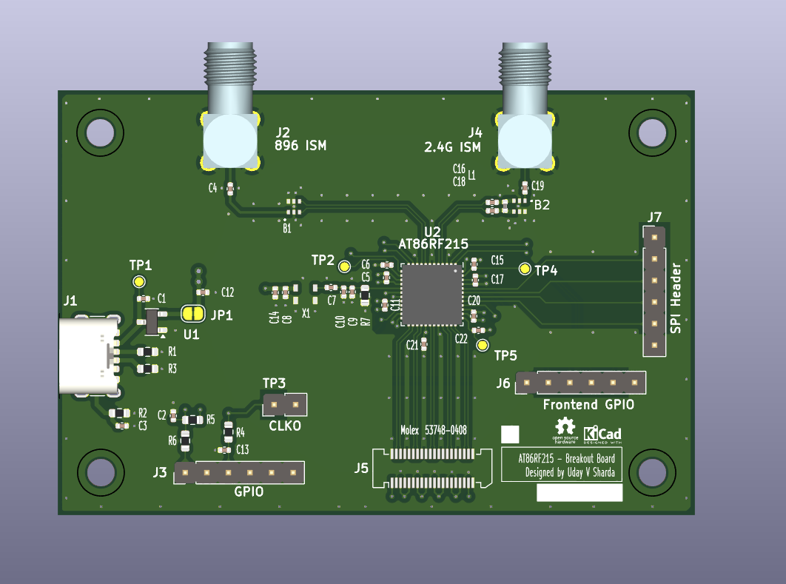

# AT86RF215-Breakout-Board
AT86RF215 Breakout Board is a **4-layer controlled impedance board with JLCPCB's JLC04161H-3313 Stackup.**  AT86RF215xx is a fully integrated radio transceiver covering 389.5-510MHz / 779-1020MHz / 2400-2483.5MHz. It is configured using the SPI bus to recieve and transmit while simultaneously operating the sub-1GHz and 2.4GHz radios.The impedance-matching filter are centered on 896MHz and 2450Mhz, so the design is optimized for the 2.4Ghz ISM and 900Mhz ISM bands. At 900MHz, transmit output power can be programmed upto +14dBm. The IQ interface with a sampling frequency of up to 4MHz, give it a decent bandwith. 
[View the full PDF Schematic](https://github.com/udayVsSharda/AT86RF215-Breakout-Board/blob/main/Documents%20/PDF-%20Schematic%20AT86RF215%20Breakout-Board.pdf)

## IQ Interface
It can also be configured for custom protocols using the 13-bit IQ Interface. Baseband PHY's transceiver can be completely bypassed by feeding IQ data directely to the DAC's using LVDS.The LVDS interface is based on the IEEE standard 1596.3 1996. The LVDS interface of the AT86RF215 has a data rate of 128Mb/s, composed of 16 data bits at 4MHz, for each of the I and Q data streams from the device. The LVDS uses, double data rate (DDR), at a clock frequency of 64MHz. This flexibilty makes it **useful for custom SDR Application.** The IQ interface can be accessed by soldering a **Molex Connector Part No. 53748-0408** connecting it ing board to board connector **recepticale Molex Part No. 52991-0408** or similar 0.5mm pitch Board-to-Board Connectors.  

## Credit
[Uday Vivek Singh SHARDA](https://www.linkedin.com/in/uday-vivek-singh-sharda-988475122/)  
EENG2 P2029 ECAM LaSalle Lyon  
[KiCAD 8.0](https://www.kicad.org/)

## License
Hardware design files in this repository are licensed under the CERN-OHL-P-2.0 license.
See the LICENSE file for full terms.
